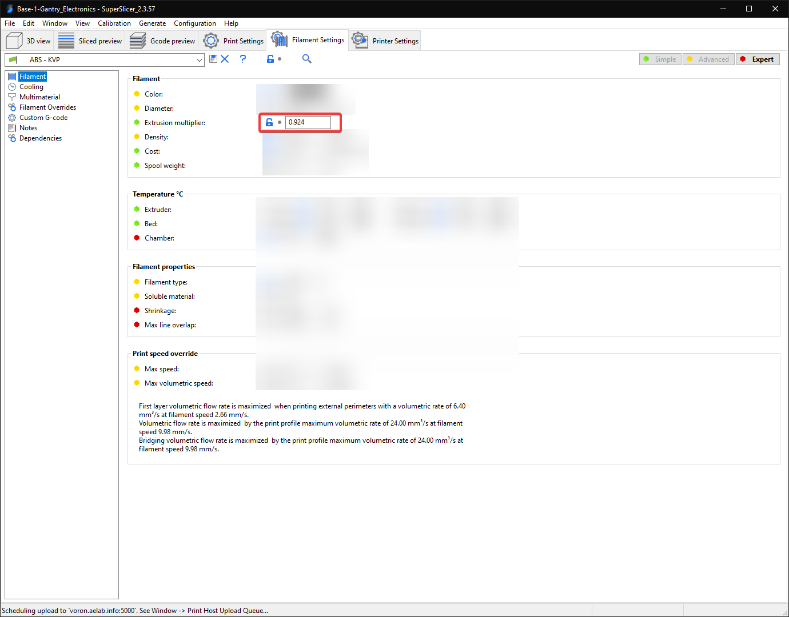
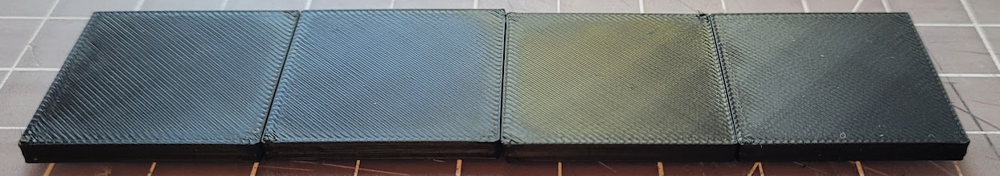
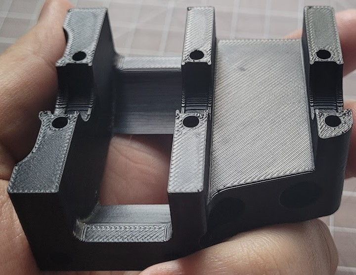

# Important Notes
<b>Please read each section fully</b>, especially anything bolded. \
There are important warnings in some of them that may cause you some headaches or confusion if missed.

This profile is more aggressive than most stock profiles, and some things may need turning down if your printer is still teething. My printer has a handful of mods that may make it more capable of slightly higher speeds and accels, so your mileage may vary. 

If you adjust speeds, accels, etc, and you should get good results on most other printers too. I use the same print settings on my Ender 3, just slowed down.

Thank you to [Stephan](https://github.com/Stephan3/Schnitzelslicerrepo) for the acceleration controls and post-processing script. Those are both adapted from his profile.

# How to Import
  

# Volumetric Speed / Auto Speed
<b>!! It is very important that you update the volumetric speed setting !!</b>

These bottom two settings in this screenshot serve as universal "speed limits". No matter how much you push speeds, layer heights, or line widths, it will never allow you to exceed these thresholds.

This is important because I keep my infill speed set to 0. This means it will print infill <b>as fast as the hotend will allow</b>, or up to the 300mm/sec, whichever comes first.

If you have the volumetric speed set too high, your extruder *will* skip and/or grind.

  

## Approximate values:

| Hotend     | Flow Rate (mm<sup>3</sup>/sec) |
| :---        |    :----:   |
| V6            | 12
| Dragon SF| 15
| Dragon HF| 24
| Mosquito| 20
| Mosquito Magnum| 30

You should be okay using an approximate value and just lowering it if you have any issues. 

<i>If you want to get more scientific, or your hotend isn't listed, see the last section ("Determining Max Volumetric Flow") for more details.</i>

# Acceleration Control

This profile uses a custom acceleration control setup. Acceleration would typically be done directly in the speed settings, but currently SuperSlicer does not allow setting accelerations for every extrusion type (for example internal vs external perimeters).

I advise leaving the accelerations conservative for anything visible, particularly for perimeters. While you *can* push the accels higher, even with input shaper I have found that it can still cause bizarre bulging issues. I now only push high accelerations for things like infill and travels.

I use 8 square corner velocity because I have found it to make corners slightly crisper.

<b>If you have not yet tuned input shaper, consider reducing these accelerations to 4000 and below.</b>

  


# Post Processing (Travel Accels)
<b>This is optional, in fact I would suggest starting with it disabled and come back to it later.</b>

The sole purpose of this post processing script is to set accels/square corner velocity for travel moves, as it is not supported by the above accel controls.

I use the script from Stephan: https://github.com/Stephan3/Schnitzelslicerrepo/blob/master/superslicer/pp.py

Install Python on your computer. Swap the python exe path and the script path accordingly. 


  

Adjust your desired accel, accel to decel, and square corner velocity at the top of the script file:

  

# Cooling

This profile uses <b>static fan speeds</b>. The community has found that varying fan speeds, particularly with high-shrinkage materials, can cause layer inconsistencies. Essentially some areas will cool and contract faster than others.

The exact fan speed will vary based on your fan, material, layer times, and chamber temps. You may need to play with this. 

I use BadNoob's AB-BN-30 duct with the Sunon fan, and my chamber temp is around 63C. The stock fan setup may need more cooling as the airflow is weaker.

  

# "45 Degree" Profile vs Standard Profile

My primary profile is the "45 degree" profile. This means that I print all of my parts at 45 degrees, with the seams set to "rear". I orient my desired seam edge towards the rear of the plate.

This makes it much easier to align the seams where I want them, as otherwise SuperSlicer tends to place them oddly.

The differences with the "45 degree" profile are:
- <b>Print Settings > Perimeters & Shell > Seam:</b> \
Rear <i>(rather than cost-based)</i>
- <b>Print Settings > Infill > Angle > Fill:</b> \
0 degrees <i>(rather than 45 degrees)</i>

  

# Start G-code
My start gcode follows the convention I laid out in my Discord pin: https://discord.com/channels/460117602945990666/460172848565190667/866045862782304326

This passes the bed, hotend, and chamber temps to my `PRINT_START` macro so that I can control exactly when they happen during my start gcode.

<b>If you have not set up your `PRINT_START` based on my Discord pin, replace this whole block with `PRINT_START` on its own.</b>

  

# Calibrating Extrusion Multiplier (Flow %)

Now we are getting more into general tuning territory.

  

## Background


This is a widely misunderstood and debated subject. Getting the perfect extrusion multiplier (EM) is *crucial* for good looking prints.

Some guides you will find online mention printing a single or two-walled object and measuring the thickness with calipers. I find this method not to work very well at all, especially with ABS, presumably due to shrinkage.

SuperSlicer has a built-in flow calibration tool, however I do not like this either, for a few reasons:
- It is very reliant on first layer squish.
- Because it uses 100% infill, the first layer squish carries through all the way to the top. 
- It has ironing turned on by default.
- The objects are too small. It's normal for smaller infill areas to look a bit more overextruded than larger infill areas.

Both of the above methods I've found to have error of up to 5% (sometimes even more) - which may not sound too bad but it makes a *huge* difference on the appearance of your prints.

## Method
By far the best method I have found is purely visual. *Put the calipers down for now*.

We will print some 30x30x3mm cubes. <i>(see the Test_Prints folder)</i>

<b>Print Settings:</b>
- <b>40% Infill</b>\
    We need sparse infill rather than 100% solid infill, to remove the first layer squish from impacting the top layer. 
    We still need enough to adequately support the top layers.</i>
- <b>120% Infill Line Width</b>\
    This just increases infill density over my normal settings, which are thicker for reducing print times.
- <b>100% Top Layer Line Width</b>\
    This one is more subject to interpretation, but I find 100% to have good results.
- <b>5 Top Layers</b>\
    This ensures that we have adequate support for the surface layer.
- <b>20-30mm/s Top Layer Speed</b>\
    This helps to remove pressure advance as a variable. The faster we go, the more pressure advance will impact our results.
- <b>0.03 Pressure Advance</b> (only if you have not yet tuned it)\
    This is simply a PA value on the lowest end of the normal range. 

<b>Steps:</b>

<b>1)</b> Print multiple test cubes with variations of 2% EM. You can do this all in once plate by adjusting settings for each object. Save it as a .3mf file for reuse later.

<b>2)</b> Inspect each cube. Once you are nearing the correct EM, the top should feel noticeably smoother. Too much EM will look and feel rougher, and too little EM will have gaps between the lines.

<b>3)</b> If desired, run the process again but with 0.5% intervals. Most PIF providers tune down to the 0.5% range, some even less. 

I have found that most ABS falls within the 91-94% range.

This image shows 0.5% intervals. Notice how the print becomes noticeably more shiny and glass-like around perfect EM (cube #3). This is not just a trick of the light. Shininess is not always the best indicator, but it makes a good visual example.

 

Example of an actual print with tuned EM:

 
# Determining Max Volumetric Flow

## Background

As mentioned at the beginning, this probably isn't necessary if you can find a "safe" value that others are using for your particular hotend. If you have a different setup affecting flow, such as a CHT nozzle or unlisted hotend, or if you just want to take the scientific approach, here is the process.

Remember - this is a rough calculation. Maximum volumetric flow rate can change with a number of factors, like temperatures, material, and nozzle type. You should set your limit slightly lower in the slicer for margin of safety, and to avoid having to tune for different filaments that don't flow as nicely.

## Formulas

Volumetric flow is expressed in mm<sup>3</sup>/sec (cubic millimeters per second)

- <b>volume = mm / 0.415.</b>

Or, inversely, 

- <b>mm = volume * 0.415.</b>

For example, if you extrude at <b>5mm/sec</b>, that comes out to <b>~12mm<sup>3</sup>/sec.</b> (5mm / 0.415)

## Method
You will follow a similar process to extruder calibration. 

<b>1)</b> Heat your hotend. \
<b>2)</b> Extrude a little bit to ensure your E motor is energized and holding.\
<b>3)</b> Mark a 120mm length of filament going into your extruder.\
<b>4)</b> Extrude at increasing speeds. At each interval, measure to ensure that exactly 100mm entered the extruder.

For example, the gcode to extrude at 5mm/sec is:
```
M83 ; Relative extrusion mode
G0 E100 F300 ; Extrude 100mm at 5mm/sec
```
Remember the the F speed is in mm/min, <b>not</b> mm/sec, so multiply your desired speed by 60.

<b>5)</b> Keep going until it starts dropping below 100mm. This is your max flow rate. \
<b>6)</b> Convert your extrusion speed to volumetric speed using the above formulas. \
<b>7)</b> Enter a slightly lower volumetric speed into the slicer.

