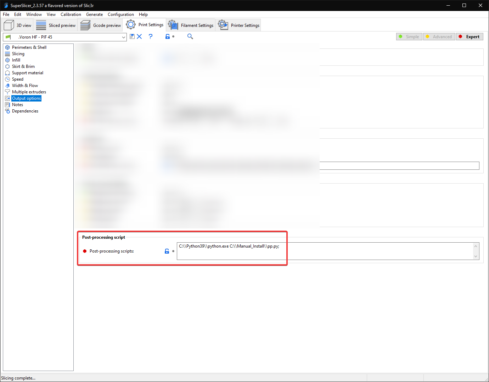
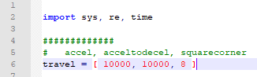

# Important Notes
**Please read each section fully**, especially anything bolded and marked with "**(!)**". \
These are important warnings in some of them that may cause you some headaches or confusion if missed.

This profile is more aggressive than most stock profiles, and some things may also need turning down if your printer is still teething. My printer has a handful of mods that may make it more capable of slightly higher speeds and accels, so your mileage may vary. There are certainly more aggressive profiles out there, but I've found this to be a good balance.

**(!) This profile's speeds/accels are tuned for linear rail CoreXY (V2/V1/Trident/V0)**. For other printer types (Switchwire, Legacy, others), you will likely need to turn down some speeds and accelerations. \
I actually use the same print settings on my Ender 3, just with speeds and accelerations toned down *(max 180mm/sec, max 1500mm/s<sup>2</sup> without input shaper)* with good results.

There are some features in this profile (notably single bottom perimeters) that are only available on the latest pre-releases of SuperSlicer.

Thank you to [Stephan](https://github.com/Stephan3/Schnitzelslicerrepo) for the acceleration controls and post-processing script. Those are both adapted from his profile.

See my [tuning guide](https://github.com/AndrewEllis93/Print-Tuning-Guide) for more generalized tuning information (primarily for Vorons running Klipper).

# Table of Contents
**(!)** = has important warning
- [How to Download](#how-to-download)
- [How to Import](#how-to-import)
- [Start G-code **(!)**](#start-g-code)
- [Volumetric Speed / Auto Speed **(!)**](#volumetric-speed--auto-speed)
- [Acceleration Control **(!)**](#acceleration-control)
- [Post Processing (Travel Accels) **(!)**](#post-processing-travel-accels)
- [Cooling](#cooling)
- ["45 Degree" Profile vs Standard Profile](#45-degree-profile-vs-standard-profile)
- [Calibrating Extrusion Multiplier](#calibrating-extrusion-multiplier)
- [Passing Variables to PRINT_START](#passing-variables-to-print_start)
- [Determining Max Volumetric Flow Rate](#determining-max-volumetric-flow-rate)
- [How Volumetric Flow Rate Relates to Print Speed](#how-volumetric-flow-rate-relates-to-print-speed)

# How to Download
**1)** Navigate to the .ini file.

**2)** Right click "Raw" and click "Save link as"

**If you do not use the "Raw" button, you will get errors trying to import.**

 

Alternatively, download the whole repository as .zip:

 
# How to Import
If you downloaded the whole repository as .zip, you will have to unzip it first.

  

Select the **\.ini** file.

# Start G-code
**(!) If you have are not yet [passing variables to `PRINT_START`](#passing-variables-to-print_start), replace this whole block with `PRINT_START` on its own.**

  
# Volumetric Speed / Auto Speed
**(!) It is very important that you update the volumetric speed setting, otherwise you may have extruder skipping and/or grinding.**

These bottom two settings in this screenshot serve as universal "speed limits". No matter how much you push speeds, layer heights, or line widths, it will never allow you to exceed these thresholds.

This is important because I keep my infill speed set to 0. This means it will print infill **as fast as the hotend will allow**, or up to the 300mm/sec, whichever comes first.

  

## Approximate Values

| Hotend     | Flow Rate (mm<sup>3</sup>/sec) |
| :---        |    :----:   |
| E3D V6            | 11
| E3D Revo            | 15
| Dragon SF| 15
| Dragon HF| 24
| Mosquito| 20
| Mosquito Magnum| 30

You should be okay using an approximate value and just lowering it if you have any issues. 

*If you want to get more scientific, or your hotend isn't listed, see the last section (["Determining Max Volumetric Flow Rate"](#determining-max-volumetric-flow-rate)) for more details.*

# Acceleration Control

This profile uses a custom acceleration control setup. Acceleration would typically be done directly in the speed settings, but currently SuperSlicer does not allow setting accelerations for every extrusion type (for example internal vs external perimeters).

This should be coming natively to SuperSlicer soon.

I advise leaving the accelerations conservative for anything visible, particularly for perimeters. While you *can* push the accels higher, even with input shaper I have found that it can cause [bizarre bulging](#bulging-from-high-accelerations) issues, at least for me. I now only push high accelerations for things like infill and travels.

I use 8 square corner velocity because I have found it to make corners slightly crisper.

**(!) If you have not yet tuned input shaper, consider reducing these accelerations to 5000 and below.**

**(!) These gcodes *override* the maximum values in your printer.cfg.**

  

## Bulging from High Accelerations

I am still not 100% sure if this was only a "me" problem, but thought I would include it anyway.

I spent ages trying to fix these bulges, and the only thing that fixed it was to lower my perimeter accelerations to 2k internal / 1k external.

  
  
# Post Processing (Travel Accels)
**(!) This is optional and will error if you don't set it up or remove it. In fact I would suggest starting with it disabled and come back to it later.**

The sole purpose of this post processing script is to set accels/square corner velocity for travel moves, as it is not supported by the above accel controls.

This should be coming natively to SuperSlicer soon.

I use the script from Stephan: https://github.com/Stephan3/Schnitzelslicerrepo/blob/master/superslicer/pp.py

Install Python on your computer. Swap the python exe path and the script path accordingly. 


  

Adjust your desired accel, accel to decel, and square corner velocity at the top of the script file:

  

# Cooling

This profile uses **static fan speeds**. The community has found that varying fan speeds, particularly with high-shrinkage materials, can cause layer inconsistencies. Essentially some areas will cool and contract faster than others.

The exact fan speed will vary based on your fan, material, layer times, and chamber temps. You may need to play with this. 

I use BadNoob's AB-BN-30 duct with the Sunon fan, and my chamber temp is around 63C. The stock fan setup may need more cooling as the airflow is weaker.

  

# "45 Degree" Profile vs Standard Profile

My primary profile is the "45 degree" profile. This means that I print all of my parts at 45 degrees, with the seams set to "rear". I orient my desired seam edge towards the rear of the plate.

This makes it much easier to align the seams where I want them, as otherwise SuperSlicer tends to place them oddly.

The differences with the "45 degree" profile are:
- **Print Settings > Perimeters & Shell > Seam:** \
Rear *(rather than cost-based)*
- **Print Settings > Infill > Angle > Fill:** \
0 degrees *(rather than 45 degrees)*

  
# Calibrating Extrusion Multiplier
This section has moved to my [print tuning guide](https://github.com/AndrewEllis93/Print-Tuning-Guide#extrusion-multiplier).
## Passing Variables to PRINT_START
**I would recommend starting with a standard PRINT_START and setting this up later.**

By default, slicers will put heating commands either entirely before or after `PRINT_START`. You have to pass the temps TO `PRINT_START` in order to control when they happen. 
For example I don’t want my nozzle to heat until the very end so it’s not oozing during QGL, mesh etc.

If you don’t use a chamber thermistor, just remove the chamber stuff. 

### Example macro:
```
[gcode_macro PRINT_START]
gcode:        
    # Parameters
    
    
    
    
    # <insert routines>
    M190 S{bedtemp}                                                              ; wait for bed temp
    TEMPERATURE_WAIT SENSOR="temperature_sensor chamber" MINIMUM={chambertemp}   ; wait for chamber temp
    # <insert routines>
    M109 S{hotendtemp}                                                           ; wait for hotend temp
    # <insert routines / nozzle clean>
    G28 Z                                                                        ; final z homing with hot nozzle
```

This would now be run like `PRINT_START BED=110 HOTEND=240 CHAMBER=50`. 
Chamber defaults to 0 if not specified.
### Slicer Start G-code

#### SuperSlicer
 ```    
M104 S0 ; Stops PS/SS from sending temp waits separately
M140 S0
PRINT_START BED=[first_layer_bed_temperature] HOTEND=[first_layer_temperature] CHAMBER=[chamber_temperature]
```

#### Prusa Slicer 
*(doesn’t support chamber temp)*
    
```
M104 S0 ; Stops PS/SS from sending temp waits separately
M140 S0
PRINT_START BED=[first_layer_bed_temperature] HOTEND=[first_layer_temperature]
```


#### Cura
```
PRINT_START BED={material_bed_temperature_layer_0} HOTEND={material_print_temperature_layer_0} CHAMBER={build_volume_temperature}
```
# Determining Max Volumetric Flow Rate

## Background

As mentioned at the beginning, this probably isn't necessary if you can find a "safe" value that others are using for your particular hotend. If you have a different setup affecting flow, such as a CHT nozzle or unlisted hotend, or if you just want to take the scientific approach, here is the process.

Remember - this is a rough calculation. Maximum volumetric flow rate can change with a number of factors, like temperatures, material, and nozzle type. You should set your limit slightly lower in the slicer for margin of safety, and to avoid having to tune for different filaments that don't flow as nicely.

## Formulas

Volumetric flow is expressed in mm<sup>3</sup>/sec (cubic millimeters per second)

- **volume = mm / 0.415.**

Or, inversely, 

- **mm = volume * 0.415.**

For example, if you extrude at **5mm/sec**, that comes out to **~12mm<sup>3</sup>/sec.** (5mm / 0.415)

For 2.85mm filament, use 0.157 instead of 0.415.

## Method
You will follow a similar process to extruder calibration. 

**1)** Heat your hotend. \
**2)** Extrude a little bit to ensure your E motor is energized and holding.\
**3)** Mark a 120mm length of filament going into your extruder.\
**4)** Extrude at increasing speeds. At each interval, measure to ensure that exactly 100mm entered the extruder.

For example, the gcode to extrude at 5mm/sec is:
```
M83 ; Relative extrusion mode
G1 E100 F300 ; Extrude 100mm at 5mm/sec
```
Remember the the F speed is in mm/min, **not** mm/sec, so multiply your desired speed by 60.

**5)** Keep going until it starts dropping below 100mm. This is your max flow rate. \
**6)** Convert your extrusion speed to volumetric speed using the above formulas. \
**7)** Enter a slightly lower volumetric speed into the slicer.

# How Volumetric Flow Rate Relates to Print Speed

Working out how quickly you can print at a given volumetric flow rate is quite simple:

- **speed = volumetric flow / layer height / line width**

Or, inversely,
- **volumetric flow = speed * line width * layer height**

For example, if your hotend is capable of 24mm<sup>3</sup>/sec, and you are printing with 0.4mm line width, at 0.2mm layer height:

- **24 / 0.4 / 0.2 = Maximum print speed of 300mm/sec**