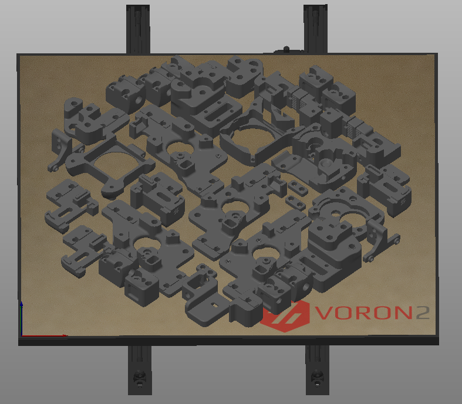

## How to Import
  

## Volumetric Speed / Auto Speed
<b>!! It is very important that you update the volumetric speed setting !!</b>

These bottom two settings in this screenshot serve as universal "speed limits". No matter how much you push speeds, layer heights, or line widths, it will never allow you to exceed these thresholds.

This is important because I keep my infill speed set to 0. This means it will print infill <b>as fast as the hotend will allow</b>, or up to the 300mm/sec, whichever comes first.

If you have the volumetric speed set too high, your extruder *will* skip and/or grind.

  

#### Approximate values:

| Hotend     | Flow Rate |
| :---        |    :----:   |
| V6            | 12
| Dragon SF| 15
| Dragon HF| 24
| Mosquito| 20
| Mosquito Magnum| 30

You should be okay using an approximate value and just lowering it if you have any issues. 

<i>If you want to get more scientific, or your hotend isn't listed, see the last section ("Determining Max Volumetric Flow") for more details.</i>

## Acceleration Control

This profile uses a custom acceleration control setup. Acceleration would typically be done directly in the speed settings, but currently SuperSlicer does not allow setting accelerations for every extrusion type (for example internal vs external perimeters).

I advise leaving the accelerations conservative for anything visible, particularly for perimeters. While you *can* push the accels higher, even with input shaper I have found that it can still cause bizarre bulging issues. I now only push high accelerations for things like infill and travels.

I use 8 square corner velocity because I have found it to make corners slightly crisper.

<b>If you have not yet tuned input shaper, consider reducing these accelerations to 4000 and below.</b>

  


## Post Processing (Travel Accels)
This is optional, <i>in fact I would start with it disabled and come back to it later.</i>

The sole purpose of this post processing script is to set accels/square corner velocity for travel moves, as it is not supported by the above accel controls.

I use the script from Stephan: https://github.com/Stephan3/Schnitzelslicerrepo/blob/master/superslicer/pp.py

Install Python on your computer. Swap the python exe path and the script path accordingly. 


  

Adjust your desired accel, accel to decel, and square corner velocity at the top of the script file:

  

## Cooling

This profile uses <b>static fan speeds</b>. The community has found that varying fan speeds, particularly with high-shrinkage materials, can cause layer inconsistencies. Essentially some areas will cool and contract faster than others.

The exact fan speed will vary based on your fan, material, layer times, and chamber temps. You may need to play with this. 

I use BadNoob's AB-BN-30 duct with the Sunon fan, and my chamber temp is around 63C. The stock fan setup may need more cooling as the airflow is weaker.

  

## "45 Degree" Profile vs Standard Profile

My primary profile is the "45 degree" profile. This means that I print all of my parts at 45 degrees, with the seams set to "rear". I orient my desired seam edge towards the rear of the plate.

This makes it much easier to align the seams where I want them, as otherwise SuperSlicer tends to place them oddly.

The differences with the "45 degree" profile are:
- <b>Print Settings > Perimeters & Shell > Seam:</b> \
Rear <i>(rather than cost-based)</i>
- <b>Print Settings > Infill > Angle > Fill:</b> \
0 degrees <i>(rather than 45 degrees)</i>

  

## Start G-code
My start gcode follows the convention I laid out in my Discord pin: https://discord.com/channels/460117602945990666/460172848565190667/866045862782304326

This passes the bed, hotend, and chamber temps to my `PRINT_START` macro so that I can control exactly when they happen during my start gcode.

If you have not set up your `PRINT_START` based on my Discord pin, replace this whole block with `PRINT_START` on its own.

  

## Determining Max Volumetric Flow

### Background

This is a rough calculation. Maximum volumetric flow rate can change with a number of factors, like temperatures, material, and nozzle type.

Once you find your maximum volumetric flow with the below method, you should still set it slightly lower in the slicer for margin of safety. I set mine slightly on the low side so that I don't have to tune it per filament/material.

### Formulas

Volumetric flow is expressed in mm^3/sec (cubic millimeters per second)

- <b>Volume = mm divided by 0.415.</b>

Or, inversely, 

- <b>mm = volume * 0.415.</b>

For example, if you extrude at <b>5mm/sec</b>, that comes out to <b>~12mm^3/sec.</b> (5mm / 0.415)

### The Process
You will follow a similar process to extruder calibration. 

<b>1)</b> Heat your hotend. \
<b>2)</b> Extrude a little bit to ensure your E motor is energized and holding.\
<b>3)</b> Mark a 120mm length of filament going into your extruder.\
<b>4)</b> Extrude at increasing speeds. At each interval, measure to ensure that exactly 100mm entered the extruder.

For example, the gcode to extrude at 5mm/sec is:
```
M83 ; Relative extrusion mode
G0 E100 F300 ; Extrude 100mm at 5mm/sec
```
Remember the the F speed is in mm/min, <b>not</b> mm/sec, so multiply your desired speed by 60.

<b>5)</b> Keep going until it starts dropping below 100mm. This is your max flow rate. \
<b>6)</b> Convert your extrusion speed to volumetric speed using the above formulas. \
<b>7)</b> Enter a slightly lower volumetric speed into the slicer.

