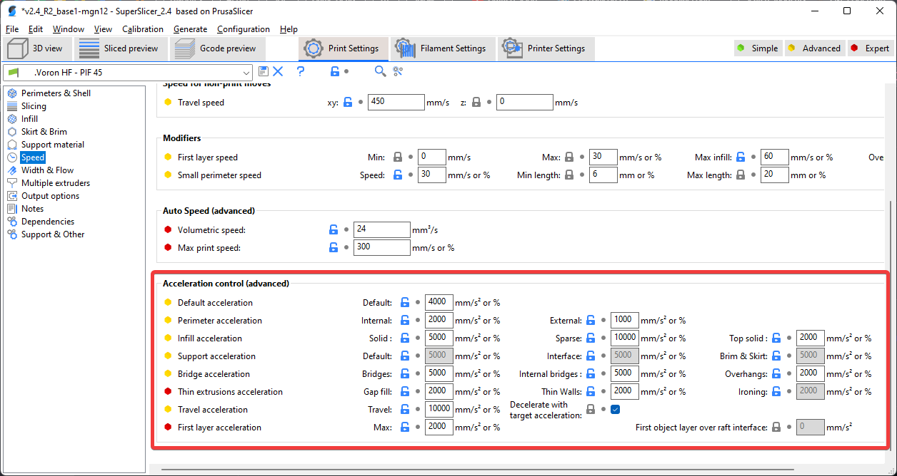
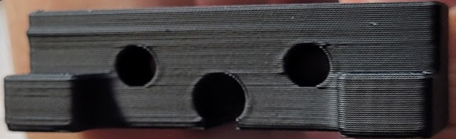

# Important Notes

## **Please [read each section fully](https://c.tenor.com/32RTX6NMyKcAAAAC/read-the-instructions-mad.gif)**, especially anything bolded and marked with "**(!)**".
### **These are important warnings in some of them that may cause you some headaches or confusion if missed.**
- **(!) I am currently using SuperSlicer [version 2.3.57.8](https://github.com/supermerill/SuperSlicer/releases/tag/2.3.57.8).** Use different SS versions at your own peril. 
    - I'm still occasionally finding bizarre bugs with this version and the previous one. 2.3.57.6 seemed to be overall more stable.
    - Newer versions often introduce new bugs, and older versions may not be compatible with certain settings.
    - I will update this as I test newer versions.

- This profile is more aggressive than most stock profiles, and some things may also need turning down if your printer is still teething. My printer has a handful of mods that may make it more capable of slightly higher speeds and accels, so your mileage may vary. There are certainly more aggressive profiles out there, but I've found this to be a good balance.

- **(!) This profile's speeds/accels are tuned for linear rail CoreXY (V2/V1/Trident/V0)**. For other printer types (Switchwire, Legacy, others), you will likely need to turn down some speeds and accelerations. \
I actually use the same print settings on my Ender 3, just with speeds and accelerations toned down *(max 180mm/sec, max 2500mm/s2 without input shaper)* with good results.

- Unfortunately, using the [custom accleration controls](#acceleration-control) in this profile can make the predicted print times less accurate. Hopefully these accleration controls we be coming natively to SuperSlicer soon. \
For now you will just have to play with "time estimation compensation" setting under *printer settings -> machine limits*.

**See my [tuning guide](https://github.com/AndrewEllis93/Print-Tuning-Guide) for more generalized tuning information (primarily for Vorons running Klipper).**

You can find the bed models and textures I am using in [Hartk's GitHub repo](https://github.com/hartk1213/MISC/tree/main/Voron%20Mods/SuperSlicer). The bed texture I am using is an older one from him in [VoronUsers.](https://github.com/VoronDesign/VoronUsers/tree/master/slicer_configurations/PrusaSlicer/hartk1213/V0/Bed_Shape) 

Thank you to [Stephan](https://github.com/Stephan3/Schnitzelslicerrepo) for the acceleration controls and post-processing script. Those are both adapted from his profile.

# Table of Contents
**(!)** = has important warning
- [**(!)** Profile Change Log](#profile-change-log)
- [How to Download](#how-to-download)
- [How to Import](#how-to-import)
- [**(!)** Start G-code](#start-g-code)
- [**(!)** Volumetric Speed / Auto Speed](#volumetric-speed--auto-speed)
- [**(!)** Acceleration Control](#acceleration-control)
- [**(!)** Post Processing (Travel Accels)](#post-processing-travel-accels)
- [Cooling](#cooling)
- ["45 Degree" Profile vs Standard Profile](#45-degree-profile-vs-standard-profile)
- [Tips and Tricks](#tips-and-tricks)

# Profile Change Log

Rather than having to re-import the profiles when updates are made, please check the change log occasionally to grab important settings changes / bug fixes.

Use **ctrl + f** in SuperSlicer to find these settings by their internal names below.

- **2022-01-02:** Change ***first_layer_height*** to **0.24**.
    - SuperSlicer currently has a weird bug causing slicing to give up part way through. Setting first layer height to something that's not 0.25 fixes it for me. ¯\\\_(ツ)_/¯
- **2021-12-29:** Change ***resolution*** to **0.0125** (new SS default) and update formatting of ***feature_gcode***
    - Some have reported "move out of range" errors with the old resolution setting of 0.002, likely a bug in SS.
    - The feature_gcode change is purely stylistic. 
- **2021-12-01:** Enable ***ensure_vertical_shell_thickess*** and revert ***solid_over_perimeters*** to default (2)
    - This can prevent occasional perimeter gapping on steep angles.
- **2021-11-19:** Set accel_to_decel values to half of accel values in ***feature_gcode***.
    - Previously accel and accel_to_decel were the same value.
- **2021-11-19:** Set new ***bridge_overlap_min*** setting to **50%**
    - Fixes 50% bridge density in new SuperSlicer version (2.3.57.6).
- **2021-11-11:** Change ***fill_pattern*** to **grid**.
    - Previously adaptive cubic. Caused occasional pillowing.
- **2021-11-11:** Change ***max_layer_height[0]*** to **75%**.
    - Previously 0.3mm. Support for nozzle size based percentages was added.
- **2021-11-11:** Reduce **seam_gap** to **0.**
    - Previously 15% internally. A new SS update now allows control over it. This should prevent seam gaps that occasionally cropped up previously.
- **2021-11-07:** Fix various support material settings.
    - Supports are disabled in this profile, but the disabled settings had some unnecessary leftovers.
- **2021-11-07:** Added quotes around ***post_process*** paths.
    - This fixes an issue where it would error if trying to use a path with a space.
- **2021-10-31:** Reduce ***retract_length[0]*** to **0.5mm**
    - Previously set to 1mm, which was a bit too aggressive to start with.
- **(!) 2021-10-31:** Change ***overhangs_width_speed*** to **0**.
    - This completely disables applying bridge settings to overhangs.
    - This setting was causing issues for some people, essentially setting overhangs to use 85% flow and high speeds.
- **2021-10-24:** Disable ***only_one_perimeter_first_layer***.
    - This was causing SS to crash when slicing first layer test patches.
    - I also just changed my mind about the aesthetics.
- **2021-10-24:** Change ***time_estimation_compensation*** to  **133%.**
    - Previously set to 87%. 
    - This should make the time estimates a *bit* closer to reality, at least with Voron parts. As mentioned above, they will still only be so accurate with the custom acceleration controls, however.

# How to Download
**1)** Navigate to the .ini file.

**2)** Right click "Raw" and click "Save link as"

**If you do not use the "Raw" button, you will get errors trying to import.**

 

Alternatively, download the whole repository as .zip:

 
# How to Import
If you downloaded the whole repository as .zip, you will have to unzip it first.

  

Select the **\.ini** file.

# Start G-code
**(!) Replace everything in this box with just `PRINT_START` if you are not yet passing variables to `PRINT_START`.**
- See the "Passing Slicer Variables to `PRINT_START`" section in my [print tuning guide.](https://github.com/AndrewEllis93/Print-Tuning-Guide#passing-slicer-variables-to-print_start)
- **I would recommend starting with a standard PRINT_START and setting this up later.**

  
# Volumetric Speed / Auto Speed
**(!) It is very important that you update the volumetric speed setting, otherwise you may have extruder skipping and/or grinding.**

These bottom two settings in this screenshot serve as universal "speed limits". No matter how much you push speeds, layer heights, or line widths, it will never allow you to exceed these thresholds.

This is important because I keep my infill speed set to 0. This means it will print infill **as fast as the hotend will allow**, or up to the 300mm/sec, whichever comes first.

  

## Approximate Values

See the "approximate values" section of my [print tuning guide.](https://github.com/AndrewEllis93/Print-Tuning-Guide#approximate-values)

If you want to get more scientific, test with a specific nozzle or setup, or your hotend just isn't listed, see the section titled "Determining Max Volumetric Flow Rate" in my [print tuning guide.](https://github.com/AndrewEllis93/Print-Tuning-Guide#determining-maximum-volumetric-flow-rate)

# Acceleration Control

This profile uses a custom acceleration control setup. Acceleration would typically be done directly in the speed settings, but currently SuperSlicer does not allow setting accelerations for every extrusion type (for example internal vs external perimeters).

**Update:** this should be coming [natively to SuperSlicer soon.](https://github.com/supermerill/SuperSlicer/pull/1858)

I advise leaving the accelerations conservative for anything visible, particularly for perimeters. While you *can* push the accels higher, even with input shaper I have found that it can cause [bizarre bulging](#bulging-from-high-accelerations) issues, at least for me. I now only push high accelerations for things like infill and travels.

I use 8 square corner velocity because I have found it to make corners slightly crisper.

**(!) If you have not yet tuned input shaper, consider reducing these accelerations to 5000 and below.**

**(!) These gcodes *override* the maximum values in your printer.cfg.**

  

## Bulging from High Accelerations

I am still not 100% sure if this was only a "me" problem, but thought I would include it anyway.

I spent ages trying to fix these bulges, and the only thing that fixed it was to lower my perimeter accelerations to 2k internal / 1k external.

  
  
# Post Processing (Travel Accels)
**(!) This is optional and will error if you don't set it up or remove it. In fact I would suggest starting with it disabled and come back to it later.**

**Update:** this should be coming [natively to SuperSlicer soon.](https://github.com/supermerill/SuperSlicer/pull/1858) It might be better to just wait.

The sole purpose of this post processing script is to set accels/square corner velocity for travel moves, as it is not supported by the above accel controls.

I use the script from Stephan*: https://github.com/Stephan3/Schnitzelslicerrepo/blob/master/superslicer/pp.py

Install Python on your computer. Swap the python exe path and the script path accordingly. 

  

Adjust your desired accel, accel to decel, and square corner velocity at the top of the script file:

  

\* *Some people have been reported issues getting this script working, even though they appear to have it set up correctly. VintageGriffin (yak#0417) on Discord has posted a version that some are reporting better success with, but I have not yet tried it myself: [**Link**.](https://discord.com/channels/460117602945990666/460172848565190667/890777697989566594) His version moves all of the accel controls outside of the slicer, and supports travel accels. The instructions are in the comments of the macros.*

# Cooling

This profile uses **static fan speeds**. The community has found that varying fan speeds, particularly with high-shrinkage materials, can cause layer inconsistencies. Essentially some areas will cool and contract faster than others.

The exact fan speed will vary based on your fan, material, layer times, and chamber temps. You may need to play with this. 

I use BadNoob's AB-BN-30 duct with the Sunon fan, and my chamber temp is around 63C. The stock fan setup may need more cooling as the airflow is weaker.

  

# "45 Degree" Profile vs Standard Profile

My primary profile is the "45 degree" profile. I orient the STLs to be at a 45 degree angle.

## Pros
- Easier seam placement for large numbers of parts using "rear" seams.
    - Orient the desired seam edge towards the rear of the plate (preferably the sharpest edge).

    - The alternative is "cost-based" *(similar to "sharpest corner" in Cura)*. Cost-based does a good job of placing the seams in corners, but crucially it does not align them. They tend to be scattered around the print at random corners.

- With CoreXY, 45 degree motions only use one motor. 
    - This can sometimes lead to better surface quality. Patterns can sometimes occur when both motors are in use.
## Cons
- Rear seams *don't tend to align nicely on rounded corners.*

    -   
    - I usually try to orient the sharpest corner to the rear of the place. 
    - For objects with only rounded corners, I will sometimes manually place the seam.

- Sometimes the seams can still be placed oddly. Have a quick look at the gcode preview before printing.

Manual seam placement will **always** have the best results. This method is a compromise to save myself a lot of manual work for plates with large numbers of parts.

## Config Differences

The differences with the "45 degree" profile are:
- **Print Settings > Perimeters & Shell > Seam:** \
Rear *(rather than cost-based)*
- **Print Settings > Infill > Angle > Fill:** \
0 degrees *(rather than 45 degrees)*

  

## Rotating All Parts

Press ctrl+a to select all objects. \
Type the rotation amount in "Z" the box at the bottom right:

 
# Tips and Tricks
## Part Spacing / Plating
Right click the "arrange" button to change part spacing. 

 

Then click the arrange button (or press A), to automatically arrange everything.
