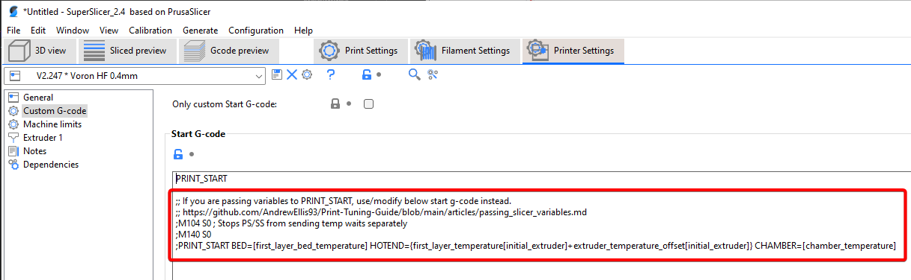
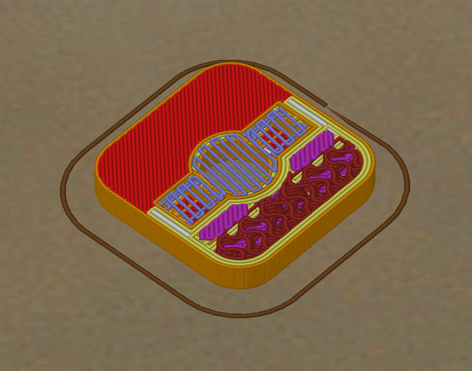

## **Please <ins>read each section</ins>**, especially anything marked with ":warning:". **These are important warnings that may cause you issues if missed.**

# Important Notes

:warning: **Required SuperSlicer version:** [:page_facing_up:**2.4.58.5**](https://github.com/supermerill/SuperSlicer/releases/tag/2.4.58.5) (last update: 2022-11-07)

- **You may want to back up your `%appdata%\SuperSlicer` folder before updating, just in case.**
- **Use different SS versions at your own peril.**
    - Newer versions often introduce new bugs or defaults, and older versions may not be compatible with certain settings (or will just error when importing the profile)
    - I will update this as I test newer versions.

**:warning: This profile's speeds/accels are tuned for linear rail CoreXY (specifically MY personal V2).**
- Your own printer, and especially other printer types, may need lower speeds and accelerations. 
- That said, these speeds are perfectly achievable on any well-built stock V2/Trident/V0.

---

# Introduction

**See my [:page_facing_up:tuning guide](https://github.com/AndrewEllis93/Print-Tuning-Guide) too!**

Originally this repo was set up to share my own profiles as-is, plastered with warnings of what to turn down. Over time, however, they have become more and more tailored for sharing and for the community at large.

SuperSlicer can be tricky. There are a few problematic "landmine" defaults. These profiles try to remove as many of those headaches as possible, to hopefully ease your transition. I have spent a lot of time experimenting with different settings to hopefully save others from having to repeat the same troubleshooting. The [:pushpin:change log](#profile-change-log) tells a story.

These profiles can work well on **any printer**, provided you adjust the speeds, accels, machine limits/dimensions, and volumetric flow limit accordingly. I actually use the same profiles on my Ender 3.

These profiles are constantly evolving. Please check the [:pushpin:change log](#profile-change-log) occasionally to grab the new settings/findings, so you don't have to reimport the entire profile.

You can find the bed models and textures I am using in [:page_facing_up:here](https://github.com/VoronDesign/Voron-Extras/tree/main/Bed_Models).

Support my drinking habits:
[](https://www.paypal.com/paypalme/AndrewEllis93)

---

# Table of Contents
**:warning: = HAS IMPORTANT WARNING / POTENTIAL HEADACHE**
- [How to Download](#how-to-download)
- [How to Import](#how-to-import)
- [Start G-Code](#start-g-code)
- [Volumetric Speed Limiting](#volumetric-speed-limiting)
- [Accelerations](#accelerations)
- [**:warning:** Extrusion Multiplier](#extrusion-multiplier)
- [**:warning:** Cooling](#cooling)
- [**:warning:** Nozzle Flats](#nozzle-flats)
- ["45 Degree" Profile vs Standard Profile](#45-degree-profile-vs-standard-profile)
- [Infill Line Widths](#infill-line-widths)
- [Suggested Changes for PLA](#suggested-changes-for-pla)
---
- [Miscellaneous Tips and Tricks](#miscellaneous-tips-and-tricks)
    - [Changing PA Based on Nozzle Size](#changing-pa-based-on-nozzle-size)
    - [Part Spacing / Plating](#part-spacing--plating)
    - [Advanced Bridging Over Holes (Sacrificial Bridges)](#advanced-bridging-over-holes-sacrificial-bridges)
---
- [**:bulb:Profile Change Log**](#profile-change-log)

---
# How to Download
**1)** Navigate to the .ini file.

**2)** Right click "Raw" and click "Save link as"

**If you do not use the "Raw" button, you will get errors trying to import.**

-  

Alternatively, download the whole repository as .zip:

-  

- Or, if you have git installed, just `git clone https://github.com/AndrewEllis93/Ellis-SuperSlicer-Profiles.git` from your directory of choice.
# How to Import
If you downloaded the whole repository as .zip, extract it.

Select **file -> import -> import config** or press ctrl+L.
-   

Select the **\.ini** file of the profile you want to import.

Open each tab and click the floppy icon to save the profile. You may have to pick a new name. (you can type in the box that pops up!)
-  

# Start G-Code

If you are passing temperatures to your PRINT_START macro, make sure to uncomment/modify the start gcode appropriately.

See the [:page_facing_up:"Passing Slicer Variables to `PRINT_START`"](https://github.com/AndrewEllis93/Print-Tuning-Guide/blob/main/articles/passing_slicer_variables.md) section of my tuning guide for more information.

  

# Volumetric Speed Limiting

The profiles folder contains profiles with this set to 11, 15, 24, and 30mm<sup>3</sup>/sec. Choose the appropriate value for your specific hotend (see below).

**If you set this too high for your hotend, you may have extruder skipping and/or filament grinding.**

  

## What is a Volumetric Speed Limit?

The volumetric speed limit controls the maximum rate that your hotend is allowed to extrude. No matter how much you push speeds, layer heights, or line widths, **it will never allow you to outrun your hotend.**

Even when not pushing for speeds, I highly recommend putting an appropriate value for your hotend. It's a great failsafe.

I keep my infill speed set to **300mm/s**. This is the absolute max I want my infill to ever print - but in reality, it will usually print more slowly due to this limit. This essentially prints infill **as fast as the hotend will allow, up to 300mm/s.**

For more reading, formulas, and methods to test your own max flow rate, see [:page_facing_up:Determining Max Volumetric Flow Rate](https://github.com/AndrewEllis93/Print-Tuning-Guide/blob/main/articles/determining_max_volumetric_flow_rate.md).

# Accelerations
These accelerations are tuned with my personal V2. As always, your results may vary.

  

## Without Input Shaper
Choose a profile fom a "No Input Shaper" folder.

## With Input Shaper
Choose a profile fom an "Input Shaper" folder.

Find the max recommended acceleration from the upper right area of your resonance graph.

If any of the profile's accelerations (*excluding* travel acceleration*) exceed your maximum, lower them down to that maximum value.

- \*Travels can usually **exceed** the max if you wish. See [:page_facing_up:here](https://github.com/AndrewEllis93/Print-Tuning-Guide/blob/main/articles/determining_max_speeds_accels.md) to determine your max travel accels.

    - The max is the approximate point where excessive rounding/smoothing may occur, NOT your absolute maximum movement acceleration.

I would still personally recommend keeping low accelerations for things like perimeters. Your IS tune can drift over time with belt tensions. I've also had some bulging issues when pushing perimeter accelerations. Set it and forget it.

# Extrusion Multiplier
### :warning: **The extrusion multiplier (EM) is tuned for my particular filament brand/batch. You will have to tune yours for your particular filament.**

See [:page_facing_up:here](https://github.com/AndrewEllis93/Print-Tuning-Guide/blob/main/articles/extrusion_multiplier.md) for tuning instructions.


# Cooling
This profile uses **static fan speeds**. The community has found that varying fan speeds, particularly with high-shrinkage materials, can cause layer inconsistencies.

### **:warning:Your optimal fan speed will vary based on your fan, material, layer times, and chamber temps.**
**My fans speeds may be too high for you, especially if your chamber is cooler than mine (~65C).**

See my the [:page_facing_up:"cooling and layer times"](https://github.com/AndrewEllis93/Print-Tuning-Guide/blob/main/articles/cooling_and_layer_times.md) section of my tuning guide.

I use Stealthburner with a Sunon 5015 fan.

  

# Nozzle Flats
### **:warning: My profiles use some aggressive line widths, which may not work well with some pointier nozzles.**

You will only get good results **if your nozzle flat is wide enough to support the requested line width.** You can get a rough measurement of your nozzle flat with calipers.

This can cause thicker extrusion lines (like the infill) to curl up around the nozzle - and even occasionally cause gapping issues with the thinner perimeters, if it's pointy enough.

## May cause issues.

 

## Better.


# "45 Degree" Profile vs Standard Profile
My primary profile is the "45 degree" profile. I orient the STLs to be at a 45 degree angle.

  

## Pros
- **The main reason I do this** is simply for easier seam placement for large numbers of parts using "rear" seams.
    - Orient the desired seam edge towards the rear of the plate (preferably the sharpest edge).
    - The alternative is "cost-based", which does a good job of placing the seams in corners, but crucially it does not align them. They tend to be scattered around the print at different corners.
    - Rear seams:
        - :heart_eyes:
        - 
    - vs. "corners" seams:
        - (ehhhhh)
        - 
    - Force-aligning the seams can help with layer consistency. The other options can all allow the seam to jump around. That can cause artifacts like this:
        - You can see bands where the seam has hopped to a different edge of the print.
        - *(This example is has the pressure advance a bit too low, but it helps to better demonstrate the effect)*
        - 
- With CoreXY, 45 degree motions only use one motor. 
    - This can sometimes lead to better surface quality on straight walls. Patterns (VFAs) can sometimes occur when both motors are in use (with certain motor models).
- Can *sometimes* result in better overhangs. It seems that airflow sometimes prefers 45 degree prints.

## Cons
- It can sometimes be harder to fit as many parts this way.
- Sometimes the seams can still be placed oddly. Have a quick look at the gcode preview before printing.

Manual seam placement will **always** have the best results. This method is a compromise to save myself a lot of manual work for plates with large numbers of parts.

## Rotating Parts

SuperSlicer allows you to set auto rotation when importing models in your printer profile:
-  

To manually rotate, press **ctrl+a** to select all objects. \
Type the rotation amount in "Z" the box at the bottom right:

-  
# Infill Line Widths

The infill line widths are set to a high value in my profile (160%) to save some print time, and to help with infill layer adhesion strength. 

**This proportionally reduces the amount of lines to be printed.** The overall coverage area is still 40%.

If you need greater top layer support, or are printing decorative / low infill parts, you may want to reduce this value for for greater line density.

## 40% Infill @ 180% Line Width
-  

## 40% Infill @ 110% Line Width
-  

# Suggested Changes for PLA

These profiles should largely work **as-is** for PLA. You will just need to set up another filament profile.

There is only one actual print setting that may need changing.

## Print Settings
- If using supports, you *may* need a larger **support z-offset** (`support_material_contact_distance`/`support_material_bottom_contact_distance`)
    - PLA has better layer adhesion than ABS, so supports are harder to remove. 
    - The current value of 0.1mm still reportedly works fine for PLA for some people, however. You just need to print some support tests on your own machine. 

## Filament Profile
You can just duplicate the provided ABS profile and make these changes to it:
- Increase **fan speed** to 100% (`min_fan_speed`)
- Set **layer time goal** to 5-10 seconds (`slowdown_below_layer_time`)
- Set **chamber temperature** to 0
    - This only actually does anything if you're [:page_facing_up:passing it to your PRINT_START macro](https://github.com/AndrewEllis93/Print-Tuning-Guide/blob/main/articles/passing_slicer_variables.md).
- You may need to set the filament profile's [:page_facing_up:**max volumetric speed**](https://github.com/AndrewEllis93/Print-Tuning-Guide/blob/main/articles/determining_max_volumetric_flow_rate.md) (`filament_max_volumetric_speed`) a bit lower. 
    - PLA doesn't always achieve the same flow rates that ABS can. 
    - The filament profile settings **take precedence over the print settings profile**.
        - This means you can have a "default" set in the print settings profile, and then tweak it here for individual filaments.
- Set/calibrate the usual filament-specific parameters:
    - **Temperatures**
    - [:page_facing_up:**Pressure advance**](https://github.com/AndrewEllis93/Print-Tuning-Guide/blob/main/articles/pressure_advance.md)
        - (not actually a setting in SS, has to be set in printer.cfg or done with custom filament g-code)
    - [:page_facing_up:**Extrusion multiplier**](https://github.com/AndrewEllis93/Print-Tuning-Guide/blob/main/articles/extrusion_multiplier.md)


---
# Miscellaneous Tips and Tricks
## Changing PA Based on Nozzle Size

You can add the below code snippet to your filament's **custom g-code** section in order to have different PA values for different nozzle sizes. Wider nozzles need lower PA.

```
; Set pressure advance per-filament for different nozzle sizes
{if nozzle_diameter[0]==0.4}SET_PRESSURE_ADVANCE ADVANCE=0.0x
{elsif nozzle_diameter[0]==0.6}SET_PRESSURE_ADVANCE ADVANCE=0.0x
{endif}
```
Macro syntax: https://help.prusa3d.com/article/macros_1775
## Part Spacing / Plating
Right click the "arrange" button to change part spacing. 

 

Then click the arrange button (or press A), to automatically arrange everything.

Too close can introduce cooling issues. I tend to spread parts out when I can.
## Advanced Bridging Over Holes (Sacrificial Bridges)
*This section was contributed by [:page_facing_up:akhamar](https://github.com/akhamar). Thanks!*

To avoid the need to add tapered screw holes over countersinks, you can instead use a setting in SuperSlicer that allows for bridging over holes.

It is not a magic bullet, and still need to be used on a case basis, but usually works on countersinks for screws.

### SuperSlicer Option
The SuperSlicer option is called `"No perimeters on bridge areas"`, located in the advanced section of "Perimeters and Shell".
- The internal setting name is `no_perimeter_unsupported_algo`.

- 

### Results
- Previously, this example part would have had **no bridging layer**, which could cause the layer over the void/hole to attempt to print midair.
    - The perimeter circles (yellow/orange) would be printed midair and fall. 
    - The ends of the infill lines (purple) around the hole would be partially printed midair and fall.
- With this setting, a sacrificial bridge is printed for support, which can then be broken through with the screw.
- 
- 
- 

---
# Profile Change Log

Rather than having to re-import the profiles when updates are made, please check the change log occasionally to grab important settings changes / bug fixes.

Use **ctrl + f** in SuperSlicer to find these settings by their internal names below.
 
- **2022-11-09** (flip flopping edition!)
    - ***ensure_vertical_shell_thickness*** - disable.
        - Just saving some print time / material. 
    - ***retract_lift_top*** and ***retract_before_travel*** - revert to defaults *(from the 2022-11-07 changes)*.
        - These brought an additional minor improvement to small infill areas, but I eventually decided that the potential top surface scarring wasn't worth it. 
        - If you are having small infill overextrusion issues, it may be worth trying still.
        - Again, more reading on this subject is documented [:page_facing_up:here](https://github.com/AndrewEllis93/Print-Tuning-Guide/blob/main/articles/troubleshooting/small_infill_areas_overextruded.md#not-connected-top-infill-superslicer).
    - ***support_material_interface_layers*** - set to 2 (standard) - was 3 (heavy)
        - The new default of 3 interface layers is a bit excessive in most cases.
    - Minor rewording of comments in custom g-code sections
- **2022-11-08**
    - Add "Decorative Standard" profiles
    - Rename .ini files
    - ***wall_thickness_lines*** - set to 0.
        - This was in my profiles but this setting apparently doesn't always export properly. It just disables the feature that tries to automatically change line thicknesses to match your desired overall line width.
        - This setting is an oddball. For some reason it saves to `print_custom_variables` instead (paste `wall_thickness_lines = 0`)
    - Decorative profiles:
        - ***fill_pattern*** - set to monotonic
        - ***fill_density*** - set to 10%
    - ***resolution_internal*** - set to default (0.1mm)
        - Cleanup, just resetting to new default. Shouldn't make any major difference
- **2022-11-07**
    - **Update profiles for SuperSlicer version 2.4.58.5.**
    - These settings all come as a group. They were found to have a fairly significant improvement in small solid infill areas. Explanation [:page_facing_up:here](https://github.com/AndrewEllis93/Print-Tuning-Guide/blob/main/articles/troubleshooting/small_infill_areas_overextruded.md#not-connected-top-infill-superslicer) and demonstration [:page_facing_up:here](https://github.com/AndrewEllis93/Print-Tuning-Guide/blob/main/articles/troubleshooting/small_infill_areas_overextruded.md#demonstration).\
    They may also have a positive effect on bulging perimeters around external features, but I am still testing this theory.
        - ***infill_connection_solid*** - set to "not connected"
        - ***infill_connection_top*** - set to "not connected"
        - ***infill_connection_bottom*** - set to "not connected"
        - ***infill_overlap*** - set to 25%
        - ~~***retract_lift_top*** - set to "Not on top"~~ *(Reverted in 2022-11-09's flip-flopping editon, sorry)*
        - ~~***retract_before_travel*** - set to 0 (was default / 2)~~ *(Reverted in 2022-11-09's flip-flopping editon, sorry)*
    - New defaults modified:
        - ***enforce_retract_first_layer*** - set to 0
            - Stops Z hopping on first layer (this was the previous behavior)
        - ~~***wipe_inside_end*** - set to 0~~
            - Reverted. Was causing some seam gaps.
- **2022-11-01**
    - ***bridged_infill_margin*** - set to 300%.
        - This can help prevent some bridges detaching at the ends. The previous value of 5mm was too high and causing excessive bridging.
- **2022-10-06**
    - ***extrusion_width*** to 115% (was 125%)
        - This sets the default extrusion width. Any other widths set to 0 will use this default.
        - Some people had perimeter gapping issues at 125%.
    - ~~***bridged_infill_margin*** to 5mm (was 200%)~~
        - ~~Can help edge pillowing in features floating on infill, especially with lower infill densities.~~
    - ***external_infill_margin*** to 4mm (was 150%)
        - Can help edge pillowing in features floating on infill, especially with lower infill densities.
    - ***first_layer_extrusion_width*** to 125% (was 0 / equal to default)
        - Still the same width as before, but the default width changed so I had to make it static.
    - ***infill_extrusion_width*** to 160% (was 180%)
        - Some people were having layer shifting and infill gouging issues at 180%.
    - ***support_material_speed*** to 120 (was 150)
        - Less likely to knock over supports in PIF profiles if enabled. It was already 120 in the decorative profile.
    - ***skirts*** to 1 (was 0)
        - For those without a nozzle brush and/or purge line.
    - ***filament gcode*** 
        - Added example logic for nozzle-dependent PA.
    - ***z_step*** to 0.01 (was 0.04).
        - This setting rounds layer heights to even multiples of this value.
        - Setting it to 0.01 allows for finer layer height control.
        - The *actual* "full step distance" is **0.04mm** on a V2 w/ 1.8 degree Z motors. 0.01 still keeps it at quarter-stepping, which is more than good enough. 
            - In reality, though, a number of factors keep the motors from actually sitting at perfect full/half/quarter steps (QGL, Z offset, mesh, etc). This setting is of arguable importance for most printers. There's an argument to be made for stopping at the same position WITHIN each full step, but I haven't tested this and haven't noticed much difference.
    - Decorative profile: ***bottom_solid_layers*** to 3 (was 5)
- **2022-08-16:**
    - ***solid_over_perimeters*** to 0 (was 2 / default)
        - This could cause pillowing issues on internal slopes, particularly with small layer heights.
- **2022-08-09:**
    - Set default line width to ~~125%~~  *115% (see 2022-10-06)* and change all 120% values to 0 so that they use default (just for rounder numbers, e.g. 0.5mm widths instead of 0.48)
- **2022-08-08:**
    - Add decorative 45 degree profile.
- **2022-07-25:**
    - ***support_material_contact_distance*** set to 0.1mm (was 0.2mm).
        - I found the default of 0.2mm was giving really messy surfaces when supports are used. 
    - ***support_material_bottom_contact_distance*** set to "same as top" (was 0.2mm)
- **2022-07-18:**
    - ***extra_perimeters_overhangs*** enabled.
        - This being disabled could cause gapping issues when this profile is used for decorative parts with fewer walls (or extreme overhangs). It should not kick in for most Voron parts.
- **2022-05-25:**
    - ~~***perimeter_extrusion_width*** to ~~120%~~ 125%~~
        - ~~For more strength.~~
    - ***bridge_speed_internal*** to 100% (was 180mm/s)
        - This will match your normal bridge speed. 180mm/s was causing the internal bridges to not always attach.
    - ***curve_smoothing_angle_convex*** and ***curve_smoothing_angle_concaver*** to default.
        - These were just a leftover from an old SS upgrade.
- **2022-04-27:**
    - ***thin_perimeters*** to 80% (default)
    - ***thin_perimeters_all*** to 20% (default)
        - Both of these settings are new defaults that got didn't come over properly with the update (came over as 100% / 0%)
    - Fixed my maximum speeds in the machine limits. For some reason I thought they were in mm/min rather than mm/s... surprised nobody caught this before now.
- **2022-04-14:**
    - ***use_relative_e_distances*** back to **enabled**.
        - Some people had `M83` in their PRINT_START macros which didn't agree with this. 
- **2022-04-11:**
    - Profiles updated for new beta SuperSlicer version 2.4.58.2.
    - Acceleration controls were moved to the *print settings > speed* tab and ***feature_gcode*** and ***post_process*** were **cleared**. Some accelerations were tweaked.
        - Fine-grained acceleration controls are now natively supported. The old custom g-code method and python scripts are no longer needed! :tada::tada::tada:
    - ***first_layer_size_compensation_layers*** to **3** (was 2)
        - Greater fade distance for elephant's foot compensation, to help prevent some perimeter separation on chamfered parts.
    - ***first_layer_height*** to **0.25** (was 0.24)
        - Just reverting a previous change where I set it to 0.24 to fix a weird bug.
    - ***max_print_speed*** to **300** (was default/80)
        - This doesn't actually do anything since "auto speed" is no longer used (only volumetric speed limiting), but the default value of 80 was confusing people.
    - ***thin_walls_speed*** to **80** (was 30)
    - ***support_material_contact_distance_type*** to "**from filament**" (default) (was "from plane")
        - Cleaning up. I had changed this at one point and don't really know what it does, so default is probably better.
    - ***z_step*** to **0.04** (was default) 
        - This doesn't actually do much except affect the number of decimal places in Z moves. But some people were driving themselves nuts trying to find the "correct" value to put here, so... here.
    - ***duplicate_distance*** to **6** (default)
        - Just affects default part spacing when you auto-arrange your plate.
    - ***support_material_angle*** to **45** (only on 45 degree profile)
    - ***support_material_interface_speed*** to **100** (was 150)
        - These fast speeds could occasionally knock over supports.
    - ~~***use_relative_e_distances*** to **disabled**.~~
        - ~~Absolute mode is theoretically more accurate, but it's probably negligible.~~
    - ***time_estimation_compensation*** to **100%** (default) (was 133%)
        - This was a bodge compensating for the old custom accel controls messing with time estimates, and is no longer needed.
    - ***retract_lift_above[0]*** to **0.25mm** (was 0.2mm).
        - Set to match first layer height.
- **2022-02-19:**  
    - ~~Set accel_to_decel values to half of accel values in ***feature_gcode***.~~
        - ~~Previously accel and accel_to_decel were the same value.~~
        - ~~(Sorry, changed this multiple times now, keep flip-flopping on it)~~
    - Disable ***external_perimeter_cut_corners***
        - This could contribute VERY minorly to gapping between perimeters on corners. You would probably never notice without a magnifying glass.
- **2022-02-10:** 
    - Change ***infill_speed*** to **300** ~~and set **max_print_speed** back to default.~~
        - ***infill_speed*** was previously **0**. 
            - This was not always reaching maximum volumetric speed, due to a misunderstanding on my part of [:page_facing_up:how auto-speed works](https://github.com/supermerill/SuperSlicer/issues/1629#issuecomment-1013791149). 
            - Setting it to a maximum speed value (instead of 0) better accomplishes my intended goal (maxing out the hotend's capability for infill). 
                - See the [:pushpin:Volumetric Speed / Auto Speed](#volumetric-speed--auto-speed) section for an updated (corrected) explanation.
        - ~~**max_print_speed** was previously 300.~~
            - ~~This setting does not universally limit in the same way that the volumetric speed limit does (for some reason), so it's redundant and confusing to leave it on.~~
    - Change ***support_material_speed*** to **150**.
        - Was previously **240**. This could cause supports to not adhere properly or get knocked over (though supports are disabled by default in this profile).
- ~~**2022-01-02:**~~
    - ~~Change ***first_layer_height*** to **0.24**.~~
        - ~~SuperSlicer currently has a weird bug causing slicing to give up part way through. Setting first layer height to something that's not 0.25 fixes it for me. ¯\\\_(ツ)_/¯~~
- **2021-12-29:** 
    - Change ***resolution*** to **0.0125** (new SS default) and update formatting of ***feature_gcode***
        - Some have reported "move out of range" errors with the old resolution setting of 0.002, likely a bug in SS.
        - The feature_gcode change is purely stylistic. 
- **2021-12-01:** 
    - Enable ***ensure_vertical_shell_thickess*** and revert ***solid_over_perimeters*** to default (2)
        - This can prevent occasional perimeter gapping on steep angles.
- **2021-11-19:** 
    - Set new ***bridge_overlap_min*** setting to **50%**
        - Fixes 50% bridge density in new SuperSlicer version (2.3.57.6).
- **2021-11-11:** 
    - Change ***fill_pattern*** to **grid**.
        - Previously adaptive cubic. Caused occasional pillowing.
    - Change ***max_layer_height[0]*** to **75%**.
        - Previously 0.3mm. Support for nozzle size based percentages was added.
    - Reduce **seam_gap** to **0.**
        - Previously 15% internally. A new SS update now allows control over it. This should prevent seam gaps that occasionally cropped up previously.
- **2021-11-07:** 
    - Fix various support material settings.
        - Supports are disabled in this profile, but the disabled settings had some unnecessary leftovers.
    - ~~Added quotes around ***post_process*** paths.~~
        - ~~This fixes an issue where it would error if trying to use a path with a space.~~
- **2021-10-31:** 
    - Reduce ***retract_length[0]*** to **0.5mm**
        - Previously set to 1mm, which was a bit too aggressive to start with.
    - Change ***overhangs_width_speed*** to **0**.
        - This completely disables applying bridge settings to overhangs.
        - This setting was causing issues for some people, essentially setting overhangs to use 85% flow and high speeds.
- **2021-10-24:** 
    - Disable ***only_one_perimeter_first_layer***.
        - This was causing SS to crash when slicing first layer test patches.
        - I also just changed my mind about the aesthetics.
    - ~~Change ***time_estimation_compensation*** to  **133%.**~~
        - ~~Previously set to 87%.~~
        - ~~This should make the time estimates a *bit* closer to reality, at least with Voron parts. As mentioned above, they will still only be so accurate with the custom acceleration controls, however.~~